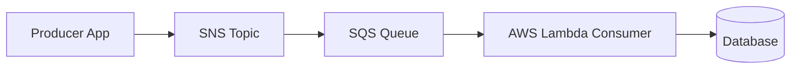
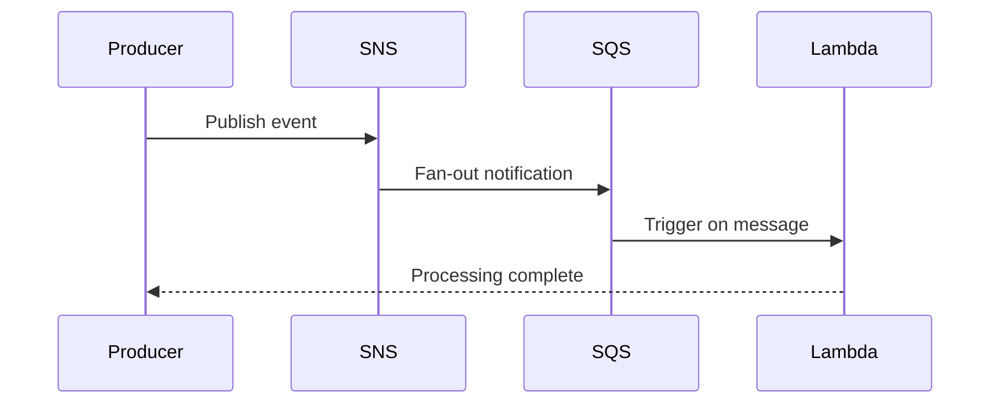

# AWS Lambda (Serverless Compute) - Faas

We just have to write the code, don't worry about the packages.

# SNS (Server Notification Service) - sends notification

# ASQ(Amazon Simple Queue) 

# Producer - Consumer Model

# How to use Mermaid here

1. Write diagrams inside a Mermaid code block in this file.
2. Open Markdown Preview in VS Code.
3. Edit the diagram text and preview updates.

Use VS Code command palette:
- Markdown: Open Preview
- Markdown: Open Preview to the Side

## Lambda + SNS + SQS flow

**FIFO :-**
- Strictly-preserved message ordering
- Exactly-once message delivery
- Subscription protocols: SQS

**Standard :-**
- Best-effort message ordering
- At-least once message delivery
- Subscription protocols: SQS, Lambda, Data Firehose HTTP, SMS, email, mobile application endpoints

## Producer-Consumer model

- Severless means you don't manage servers - but server still exist.

# Sever vs Serverless Model

